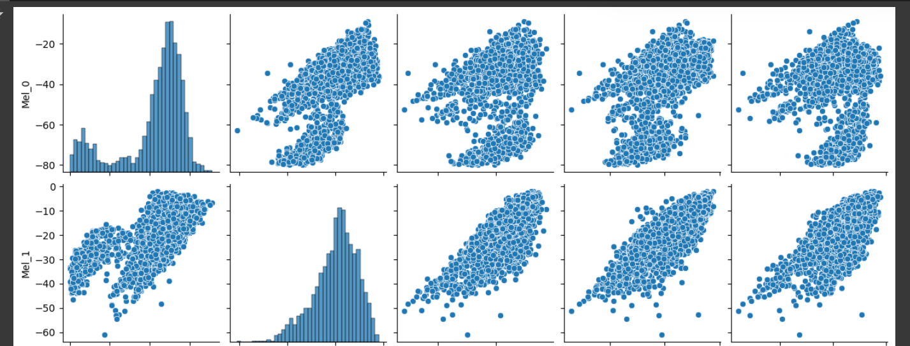
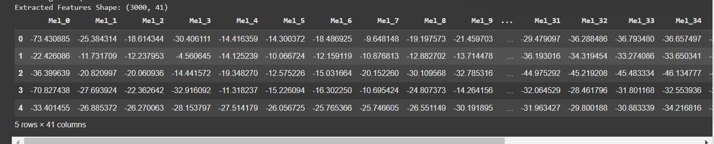
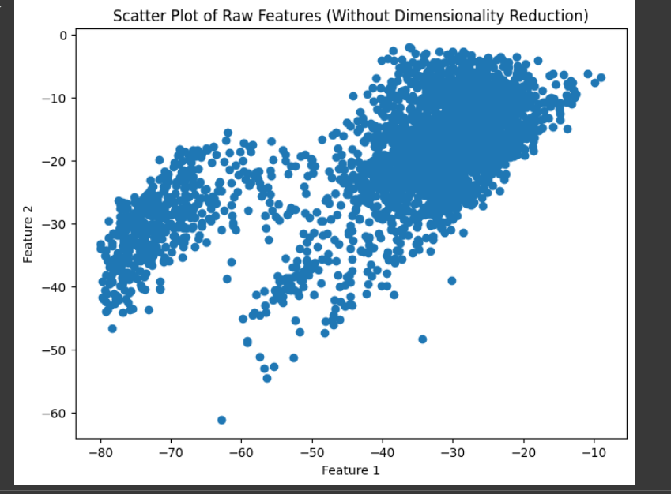
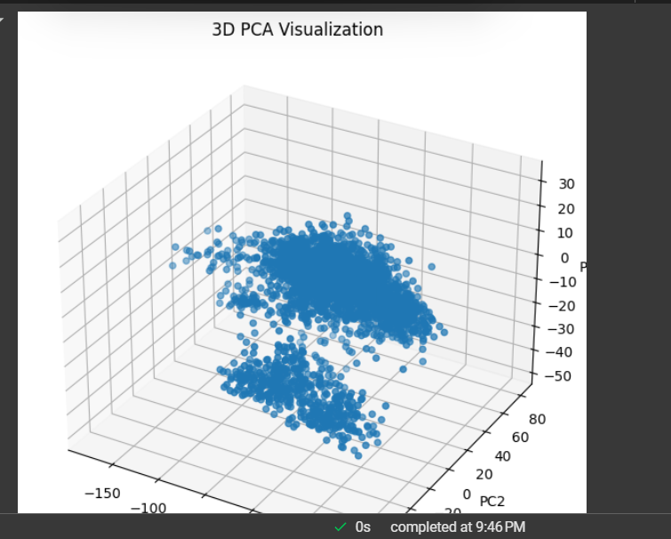

# Clustering Sound Data – Unsupervised Learning Project

## Project Overview
This project explores unsupervised clustering techniques on sound data, focusing on Mel-spectrogram features extracted from audio files. Since the actual class labels are unknown, clustering is used to uncover hidden patterns and structures within the dataset.

## Objectives
- Extract meaningful Mel-spectrogram features from raw audio data.
- Apply dimensionality reduction (PCA, t-SNE) to visualize the dataset in 2D.
- Use K-Means and DBSCAN clustering to identify natural groupings in the sound data.
- Evaluate clustering performance using Silhouette Score and Davies-Bouldin Index.
- Compare discovered clusters with actual labels (if provided later).


## Dataset
The dataset consists of audio files, each representing different sound types.
Features extracted: Mel-frequency cepstral coefficients (MFCCs) / Mel-spectrogram values.
Each sound file is represented as a numerical vector of extracted features.


Methods Used
1. Feature Extraction & Initial Visualization

Extracted Mel-spectrogram features to represent each sound file numerically.
Plotted the first two features for a quick overview of the data distribution.
2. Dimensionality Reduction
PCA (Principal Component Analysis): Reduced feature dimensions while preserving variance.
t-SNE (t-distributed Stochastic Neighbor Embedding): Provided better cluster separation in 2D visualization.
3. Clustering Techniques
K-Means Clustering:
Used the Elbow Method to determine the optimal number of clusters.
Clusters were analyzed using t-SNE visualization.
DBSCAN (Density-Based Spatial Clustering):
Identified clusters based on data density rather than a fixed number of clusters.
Compared with K-Means to determine which method worked better.
4. Clustering Evaluation
Silhouette Score: Measured how well-separated clusters are.
Davies-Bouldin Index: Evaluated cluster compactness and separation.
Compared K-Means vs. DBSCAN to determine the best clustering approach for sound data.
5. Cluster Validation
If true labels are available later, they can be compared with the discovered clusters.
Adjusted Rand Index (ARI) and Normalized Mutual Information (NMI) can measure alignment between actual classes and clusters.


## Results & Insights
* t-SNE provided better separability than PCA, revealing more distinct clusters.
* K-Means worked better than DBSCAN due to the structured nature of sound features.
* DBSCAN struggled due to variable density in the data, leading to many noise points.
* Dimensionality reduction improved clustering by reducing noise and making patterns clearer.


## How to Run the Notebook
Install necessary dependencies:

```pip install numpy pandas matplotlib seaborn librosa scikit-learn```

- Run the notebook to extract features, apply clustering, and evaluate results.
- If actual class labels are provided, run the validation section to compare clustering accuracy.

## Future Improvements
- Test different feature extraction techniques (e.g., MFCCs, Chroma features).
- Explore deep learning-based clustering (e.g., Autoencoders for representation learning).
- Fine-tune DBSCAN parameters to improve its clustering performance.

Author:
Isaiah Edem Essien

License:
This project is open-source and can be used for educational and research purposes with reference to the Author mentioned Above and the Instution African leadership University, Kigali Rwanda.
